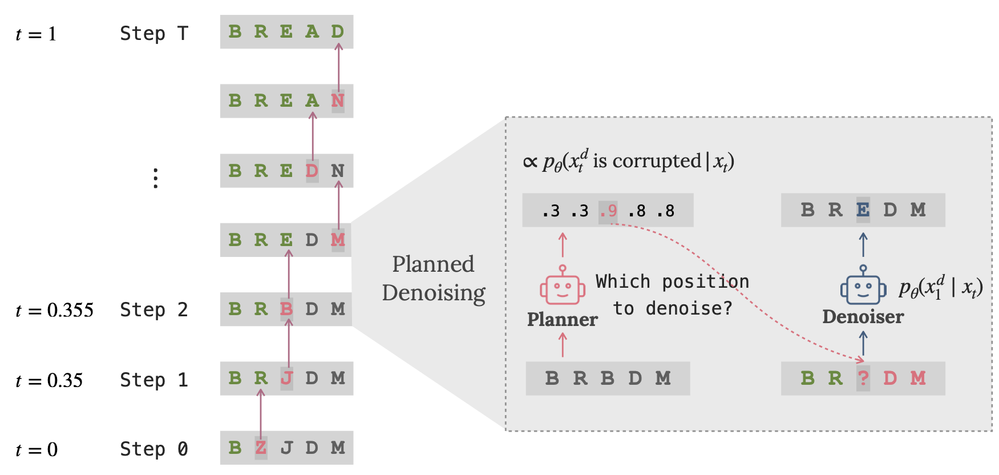
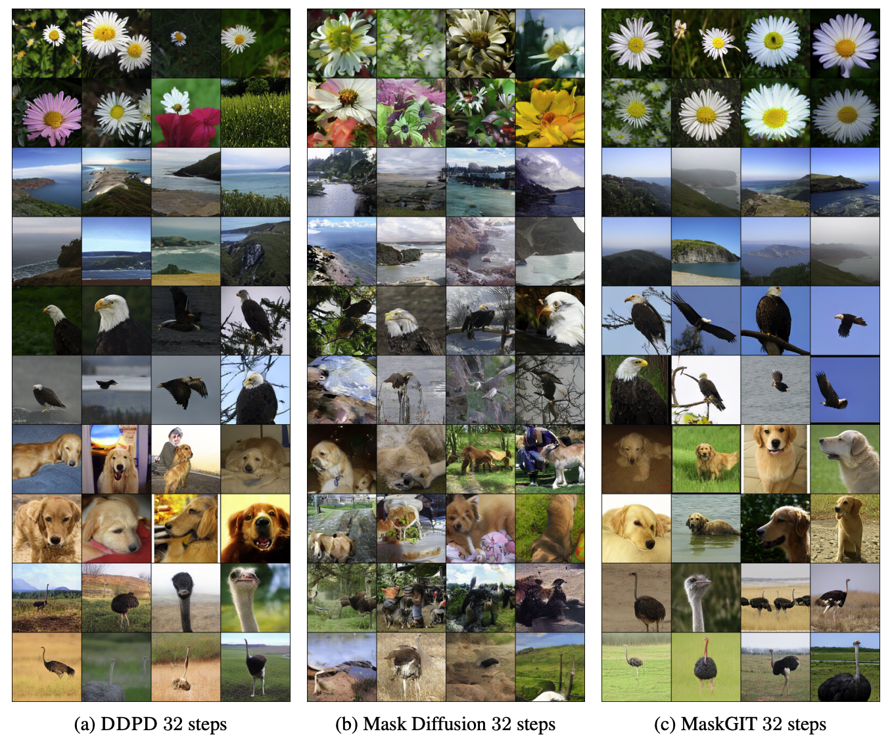

# DDPD: Discrete Diffusion with Planned Denoising
Code repository for the paper [Think While You Generate: Discrete Diffusion with Planned Denoising](https://arxiv.org/abs/2410.06264),
by Sulin Liu, Juno Nam, Andrew Campbell, Hannes Stärk, Yilun Xu, Tommi Jaakkola, Rafael Gómez-Bombarelli. Check this [tweet](https://x.com/su_lin_liu/status/1846588886493094072) for the main idea.



**Sampling process of DDPD:**
A planner is first used to determine which positions are most likely to be noise and should be denoised next. The denoiser is then applied to the selected positions conditioned on all the input tokens.


**Training objectives of the planner and denoiser:**
Cross-entropy loss for predicting the binary mask of noise tokens for the planner and cross-entropy loss for predicting the original token values for the denoiser.


--- 
## Code for text8 language modeling task
### Install environment
Package requirements are listed in `ddpd_text.yml`. [Mamba](https://mamba.readthedocs.io/en/latest/) is recommended for faster installation. Or use the latest conda with [Libmamba solver](https://www.anaconda.com/blog/a-faster-conda-for-a-growing-community).

```shell
conda env create -f ddpd_text.yml
```

### Pretrained models
Our pretrained models can be downloaed at [this link](https://huggingface.co/sulinliu/ddpd/tree/main).


### Downloading the text8 dataset
First we download the text8 data. Set the `DATA_DIR` variable within the `text8/data/download.sh` script to the location of this repository's data/text8 directory. Then run
```shell
bash text8/data/download.sh
```
Then we pre-process the downloaded data. Set the `text8_file_path` variable within the `text8/data/prepare.py` script to the location of the downloaded data. Then run
```shell
python text8/data/prepare.py
```

### Run training: denoiser
```shell
torchrun --standalone --nproc_per_node=4 train_denoiser.py text8/config/train_denoiser.py --batch_size=512 --gradient_accumulation_steps=4 --resume_dir=None --wandb_run_name='ddpd_denoiser_mask' --model_type='ddpd_denoiser_mask'
```
On a single node with 4 GPUs of 80GB memory, `batch_size` and `gradient_accumulation_steps` can be adjusted to fit in smaller GPU memory.
### Run training: planner
```shell
torchrun --standalone --nproc_per_node=4 train_planner.py text8/config/train_planner.py --batch_size=512 --gradient_accumulation_steps=4 --resume_dir=None --wandb_run_name='ddpd_planner' --model_type='ddpd_planner'
```

### Run sampling code
```shell
python sample_text8.py text8/config/sample.py
```
To replicate the results of DDPD-MaskD and DDPD-UniD in the following figure,  
```shell
bash text8/scripts/generate_samples_ddpd_maskD.sh
bash text8/scripts/generate_samples_ddpd_uniD.sh
bash text8/scripts/evaluate_samples_ddpd_maskD.sh
bash text8/scripts/evaluate_samples_ddpd_uniD.sh
```
**Results on text8 unconditional generation task:**


## Code for OpenWebText language modeling task
All code are within `owt/` folder. Code should be run within `owt/` folder.
### Install environment
```shell
conda env create -f ddpd_text.yml
```

### Run training: denoiser
```shell
python train_denoiser.py owt/configs/config_denoiser.yaml
```
Note that the config file follows original SEDD's denoiser config, which is a masked denoiser. From the reparameterization between score-entropy and $p(x_1|x_t)$ reconstruction (see Table 1 in [our paper](https://arxiv.org/abs/2410.06264) or [this paper](https://arxiv.org/abs/2406.03736)), the denoiser can be converted to a $p(x_1|x_t)$ masked denoiser.
### Run training: planner
```shell
python train_planner.py owt/configs/config_planner.yaml
```
Note that for planner, uniform noise is applied. See config file for more details.

### Pretrained models
Pretrained SEDD denoisers are hosted on HuggingFace ([small](https://huggingface.co/louaaron/sedd-small), [medium](https://huggingface.co/louaaron/sedd-medium)). Pretrained DDPD planner is here ([small](https://huggingface.co/sulinliu/ddpd/tree/main/owt_planner)). Download the planner into a folder and use load_model_local_planner to load the model.

### Run sampling code
DDPD: using SEDD-small denoiser and DDPD-small planner.
```shell
python run_sample.py --method=ddpd --steps=4096 --denoiser_model_path=louaaron/sedd-small --batch_size=50 --planner_model_path=/path/to/planner/model
```
SEDD: using SEDD-small denoiser.
```shell
python run_sample.py --method=sedd --steps=4096 --denoiser_model_path=louaaron/sedd-small --batch_size=50
```
GPT-2: using GPT-2-small.
```shell
python run_sample_gpt.py --model_id=gpt2 --top_p=0.8 --batch_size=50 --num_texts_per_gpu=50 --allow_eos
```
See `owt/scripts` for scripts of generating samples of DDPD, SEDD, and GPT-2 for the results below.

**Results on OpenWebText language modeling unconditional generation task:**


## Code for ImageNet 256x256 token generation task

All code are within `imagenet/` folder. Code should be run within `imagenet/` folder. We use the 1d tokenizer in [this paper](https://yucornetto.github.io/projects/titok.html) with the [TiTok-S-128 tokenizer](https://github.com/bytedance/1d-tokenizer/blob/main/README_TiTok.md).
### Install environment
```shell
conda env create -f ddpd_image.yml
```

### Extract tokens using the tokenizer
First prepare the tokens for training by extracting the images using the tokenizer
```shell
torchrun --nnodes=1 --nproc_per_node=1 extract_features.py --config-path configs/titok_s128.yaml
 --data-path /path/to/imagenet/ILSVRC/Data/CLS-LOC/train
 --features-path /path/to/features
```

### Train planner using extracted tokens
Update the tokens path accordingly based on where the extracted tokens are stored
```shell
accelerate launch train_planner.py config=configs/planner_s128.yaml
```
### Sampling code script
On multinode and multi GPUs.
```shell
bash scripts/sample_ddpd_nocfg.sh
```

**Results on ImageNet 256x256 token generation task:**

**Increasing number of steps:**


## Citation
```
@article{liu2024ddpd,
  title={Think While You Generate: Discrete Diffusion with Planned Denoising},
  author={Liu, Sulin and Nam, Juno and Campbell, Andrew and Stärk, Hannes and Xu, Yilun and Jaakkola, Tommi and Gómez-Bombarelli, Rafael},
  journal={arXiv preprint arXiv:2410.06264},
  year={2024}
}
```
## Acknowledgement
This repo is built on top of
[nanoGPT](https://github.com/karpathy/nanoGPT),
[discrete_flow_models](https://github.com/andrew-cr/discrete_flow_models),
[Score Entropy Discrete Diffusion](https://github.com/louaaron/Score-Entropy-Discrete-Diffusion),
[1d-tokenizer](https://github.com/bytedance/1d-tokenizer),
[fast-DiT](https://github.com/chuanyangjin/fast-DiT).
